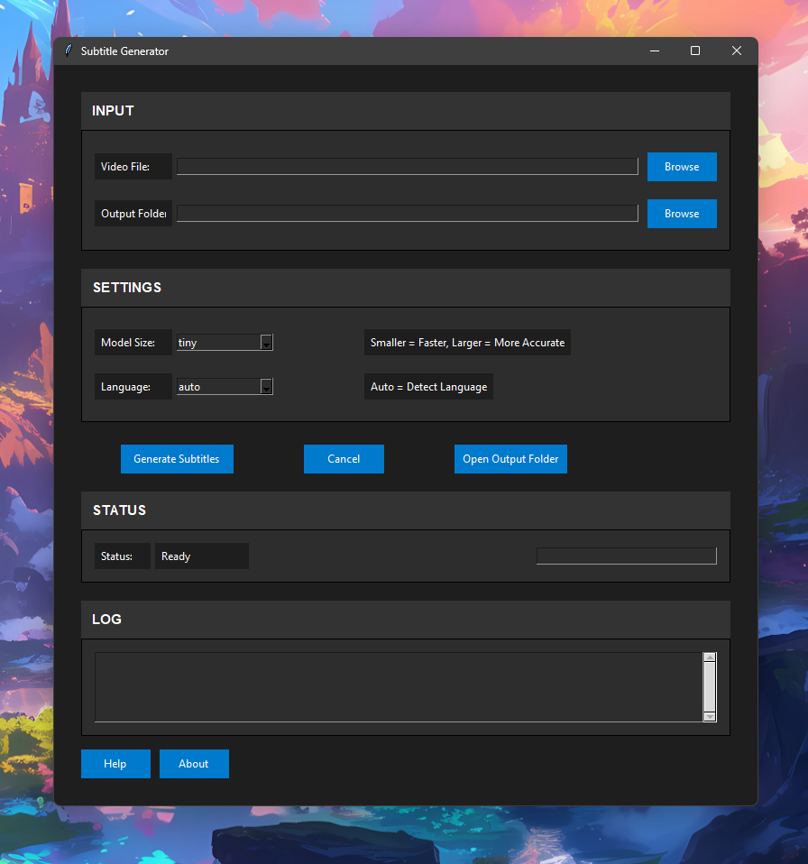

# Subtitle Generator
⠀
<pre>
 ⠀⠀⠀⠀⠀    ⠀⠀⠀⠀⠀⠀⠀⠀⠀⠀⠀⠀⠀⠀⠀⠀⠀⠀⠀⠀⠀⠀⠀⠀⠀⠀⠀⠀⠀⠀⠀⠀⠀⣾⠳⠶⣤⡄⠀⠀⠀⠀⠀⢀⣶⣄⠀⠀⠀⠀⠀⠀⠀⠀⠀⠀⠀⠀⠀⠀
⠀⠀⠀⠀   ⠀⠀⠀⠀⠀⠀⠀⠀⠀⠀⠀⠀⠀⠀⠀⠀⠀⠀⠀⠀⠀⠀⠀⠀⠀⠀⠀⠀⠀⠀⠀⠀⠀⠀⢰⡇⠀⠀⣸⠃⠀⠀⠀⠀⣴⠟⠁⠈⢻⣦⠀⠀⠀⠀⠀⠀⠀⠀⠀⠀⠀⠀
   ⠀⠀⠀⠀⠀⠀⠀⠀⠀⠀⠀⠀⠀⠀⠀⠀⠀⠀⠀⠀⠀⠀⠀⠀⠀⠀⠀⠀⠀⠀⠀⠀⠀⠀⠀⠀⠀⠀⣿⠀⠀⢠⡟⠀⠀⠀⢠⡾⠃⠀⠀⣰⠟⠁⠀⠀⠀⠀⠀⠀⠀⠀⠀⠀⠀⠀
⠀⠀⠀⠀⠀⠀⠀⠀⠀⠀⠀⠀⠀⠀⠀⠀⠀⠀⠀⠀⠀⠀⠀⠀⠀⠀⠀⠀⠀⠀⠀⠀⠀⠀ ⠀  ⠀⠀⠀⠉⠛⠓⠾⠁⠀⠀⣰⠟⠀⠀⢀⡾⠋⠀⠀⠀⢀⣴⣆⠀⠀⠀⠀⠀⠀⠀⠀
⠀⠀⠀⠀⠀⠀⠀⠀⠀⠀⠀⠀⠀⠀⠀⠀⠀⠀⠀⠀⠀⠀⠀⠀⠀⠀⢀⣀⣀⣀⣠⣤⣤⣤⣄⣀⣀⡀⠀⠀⠀⠀⠀⠀⠀⠙⠳⣦⣴⠟⠁⠀⠀⣠⡴⠋⠀⠈⢷⣄⠀⠀⠀⠀⠀⠀
⠀⠀⠀⠀⠀⠀⠀⠀⠀⠀⠀⠀⠀⠀⠀⠀⠀⠀⠀⠀⣀⣤⣴⣶⣿⣿⣿⣿⡿⠿⠿⠿⠿⠿⠿⣿⣿⣿⣿⣷⣦⣤⣀⠀⠀⠀⠀⠀⠀⠀⠀⣠⡾⠋⠀⠀⢀⣴⠟⠁⠀⠀⠀⠀⠀⠀
⠀⠀⠀⠀⠀⠀⠀⠀⠀⠀⠀⠀⠀⠀⠀⠀⢀⣠⣶⣿⣿⡿⠟⠋⠉⠁⠀⠀⠀⠀⠀⠀⠀⠀⠀⠀⠀⠈⠉⠙⠻⢿⣿⣿⣶⣄⡀⠀⠀⠀⠺⣏⠀⠀⣀⡴⠟⠁⢀⣀⠀⠀⠀⠀⠀⠀
⠀⠀⠀⠀⠀⠀⠀⠀⠀⠀⠀⠀⠀⠀⣠⣶⣿⣿⠿⠋⠁⠀⢀⣴⡿⠀⠀⠀⠀⠀⠀⠀⠀⠀⠀⠀⠀⠀⠀⠀⠀⢶⣬⡙⠿⣿⣿⣶⣄⠀⠀⠙⢷⡾⠋⢀⣤⠾⠋⠙⢷⡀⠀⠀⠀⠀
⠀⠀⠀⠀⠀⠀⠀⠀⠀⠀⠀⠀⣠⣾⣿⡿⠋⠁⠀⠀⠀⢠⣾⡟⠁⠀⠀⠀⠀⠀⠀⠀⠀⠀⠀⠀⠀⠀⣰⣦⣠⣤⠽⣿⣦⠈⠙⢿⣿⣷⣄⠀⠀⠀⠺⣏⠁⠀⠀⣀⣼⠿⠀⠀⠀⠀
⠀⠀⠀⠀⠀⠀⠀⠀⠀⠀⢠⣾⣿⡿⠋⠀⠀⠀⠀⠀⣰⣿⠟⠀⠀⠀⢠⣤⠀⠀⠀⠀⠀⠀⠀⠀⠉⠉⠉⣿⣧⠀⠀⠈⢿⣷⣄⠀⠙⢿⣿⣷⣄⠀⠀⠙⣧⡴⠟⠋⠀⠀⠀⠀⠀⠀
⠀⠀⠀⠀⠀⠀⠀⠀⠀⣴⣿⣿⠏⠀⠀⠀⠀⠀⠀⢷⣿⡟⠀⣰⡆⠀⢸⣿⠀⠀⠀⠀⠀⠀⠀⠀⣀⡀⠀⣿⣿⡀⠀⠀⠈⢿⣿⣦⠀⠀⠙⢿⣿⣦⠀⠀⠀⠀⠀⠀⠀⠀⠀⠀⠀⠀
⠀⠀⠀⠀⠀⠀⠀⠀⣼⣿⡿⠁⠀⠦⣤⣀⠀⠀⢀⣿⣿⡇⢰⣿⠇⠀⢸⣿⡆⠀⠀⠀⠀⠀⠀⠀⣿⡇⠀⢸⣿⣿⣆⠀⠀⠈⣿⣿⣧⣠⣤⠾⢿⣿⣧⠀⠀⠀⠀⠀⠀⠀⠀⠀⠀⠀
⠀⠀⠀⠀⠀⠀⠀⣸⣿⣿⣵⣿⠀⠀⠀⠉⠀⠀⣼⣿⢿⡇⣾⣿⠀⠀⣾⣿⡇⢸⠀⠀⠀⠀⠀⠀⣿⡇⠀⣼⣿⢻⣿⣦⠴⠶⢿⣿⣿⣇⠀⠀⠀⢻⣿⣧⣀⠀⠀⠀⠀⠀⠀⠀⠀⠀
⠀⠀⠀⠀⠀⠀⢀⣿⣿⣿⣿⠇⠀⠀⠀⠀⠀⢠⣿⡟⡌⣼⣿⣿⠉⢁⣿⣿⣷⣿⡗⠒⠚⠛⠛⢛⣿⣯⣯⣿⣿⠀⢻⣿⣧⠀⢸⣿⣿⣿⡄⠀⠀⠀⠙⢿⣿⣷⣤⣀⠀⠀⠀⠀⠀⠀
⠀⠀⠀⠀⠀⠀⢸⣿⣿⣿⠏⠀⠀⠀⠀⠀⠀⢸⣿⡇⣼⣿⣿⣿⣶⣾⣿⣿⢿⣿⡇⠀⠀⠀⠀⢸⣿⠟⢻⣿⣿⣿⣶⣿⣿⣧⢸⣿⣿⣿⣧⠀⠀⠀⢰⣷⡈⠛⢿⣿⣿⣶⣦⣤⣤⣀
⠀⠀⠀⠀⢀⣤⣾⣿⣿⢫⡄⠀⠀⠀⠀⠀⠀⣿⣿⣹⣿⠏⢹⣿⣿⣿⣿⣿⣼⣿⠃⠀⠀⠀⢀⣿⡿⢀⣿⣿⠟⠀⠀⠀⠹⣿⣿⣿⠇⢿⣿⡄⠀⠀⠈⢿⣿⣷⣶⣶⣿⣿⣿⣿⣿⡿
⣴⣶⣶⣿⣿⣿⣿⣋⣴⣿⣇⠀⠀⠀⠀⠀⢀⣿⣿⣿⣟⣴⠟⢿⣿⠟⣿⣿⣿⣿⣶⣶⣶⣶⣾⣿⣿⣿⠿⣫⣤⣶⡆⠀⠀⣻⣿⣿⣶⣸⣿⣷⡀⠀⠀⠸⣿⣿⣿⡟⠛⠛⠛⠉⠁⠀
⠻⣿⣿⣿⣿⣿⣿⡿⢿⣿⠋⠀⢠⠀⠀⠀⢸⣿⣿⣿⣿⣁⣀⣀⣁⠀⠀⠉⠉⠉⠉⠉⠉⠉⠁⠀⠀⠀⠸⢟⣫⣥⣶⣿⣿⣿⠿⠟⠋⢻⣿⡟⣇⣠⡤⠀⣿⣿⣿⣿⡀⠀⠀⠀⠀⠀
⠀⠀⠀ ⠉⠉⢹⣿⡇⣾⣿⠀⠀⢸⡆⠀⠀⢸⣿⣿⡟⠿⠿⠿⠿⣿⣿⣿⣿⣷⣦⡄⠀⠀⠀⠀⠀⠀⢠⣾⣿⣿⣿⣿⣯⣥⣤⣄⣀⡀⢸⣿⠇⢿⢸⡇⠀⢹⣿⣿⣿⡇⠀⠀⠀⠀⠀
⠀⠀⠀ ⠀⠀⣾⣿⡇⣿⣿⠀⠀⠸⣧⠀⠀⢸⣿⣿⠀⢀⣀⣤⣤⣶⣾⣿⠿⠟⠛⠁⠀⠀⠀⠀⠀⠀⠀⠉⠉⠉⠙⠛⢛⣛⠛⠛⠛⠃⠸⣿⣆⢸⣿⣇⠀⢸⣿⣿⣿⣷⠀⠀⠀⠀⠀
⠀⠀⠀⠀ ⠀⢻⣿⡇⢻⣿⡄⠀⠀⣿⡄⠀⢸⣿⡷⢾⣿⠿⠟⠛⠉⠉⠀⠀⠀⢠⣶⣾⣿⣿⣿⣿⣿⣶⣶⠀⠀⢀⡾⠋⠁⢠⡄⠀⣤⠀⢹⣿⣦⣿⡇⠀⢸⣿⣿⣿⣿⠀⠀⠀⠀⠀
⠀⠀⠀ ⠀ ⠀⢸⣿⣇⢸⣿⡇⠀⠀⣿⣧⠀⠈⣿⣷⠀⠀⢀⣀⠀⢙⣧⠀⠀⠀⢸⣿⡇⠀⠀⠀⠀⢀⣿⡏⠀⠀⠸⣇⠀⠀⠘⠛⠘⠛⠀⢀⣿⣿⣿⡇⠀⣼⣿⢻⣿⡿⠀⠀⠀⠀⠀
⠀⠀⠀⠀⠀ ⠸⣿⣿⣸⣿⣿⠀⠀⣿⣿⣆⠀⢿⣿⡀⠀⠸⠟⠀⠛⣿⠃⠀⠀⢸⣿⡇⠀⠀⠀⠀⢸⣿⡇⠀⠀⠀⠙⠷⣦⣄⡀⠀⢀⣴⣿⡿⣱⣾⠁⠀⣿⣿⣾⣿⡇⠀⠀⠀⠀⠀
⠀⠀  ⠀⠀⠀⠀⢻⣿⣿⣿⣿⣇⠀⢿⢹⣿⣆⢸⣿⣧⣀⠀⠀⠴⠞⠁⠀⠀⠀⠸⣿⡇⠀⠀⠀⠀⣿⣿⠀⠀⠀⠀⠀⠀⢀⣨⣽⣾⣿⣿⡏⢀⣿⣿⠀⣸⣿⣿⣿⡿⠀⠀⠀⠀⠀⠀
⠀⠀⠀⠀⠀⠀⠈⢻⣿⣿⣿⣿⣆⢸⡏⠻⣿⣦⣿⣿⣿⣿⣶⣦⣤⣀⣀⣀⣀⠀⣿⣷⠀⠀⠀⣸⣿⣏⣀⣤⣤⣶⣾⣿⣿⣿⠿⠛⢹⣿⣧⣼⣿⣿⣰⣿⣿⠛⠛⠀⠀⠀⠀⠀⠀⠀
⠀⠀⠀⠀⠀⠀⠀⠀⠉⠛⠙⣿⣿⣦⣷⠀⢻⣿⣿⣿⣿⡝⠛⠻⠿⢿⣿⣿⣿⣿⣿⣿⣿⣿⣿⣿⣿⣿⡿⠿⠟⠛⠛⠉⠁⠀⠀⠀⣼⣿⣿⣿⣿⣿⣿⣿⠃⠀⠀⠀⠀⠀⠀⠀⠀⠀
⠀⠀⠀⠀⠀⠀⠀⠀⠀⠀⠀    ⠈⢻⣿⣿⣄⢸⣿⣿⣿⣿⣷⡄⠀⠀⠀⠀⠀⠀⠀⠀⠀⠀⠀⠀⠀⠀⠀⠀⠀⠀⠀⠀⠀⠀⠀⠀⠀⠙⠿⠟⠻⣿⡿⠋⠁⠀⠀⠀⠀⠀⠀⠀⠀⠀⠀
⠀⠀⠀⠀⠀⠀⠀⠀⠀⠀⠀⠀⠀     ⠙⢿⣿⣿⣿⣿⡌⠙⠛⠁⠀⠀⠀⠀⠀⠀⠀⠀⠀⠀⠀⠀⠀⠀⠀⠀⠀⠀⠀⠀⠀⠀⠀⠀⠀⠀⠀⠀⠀⠀⠀⠀⠀⠀⠀⠀⠀⠀⠀⠀⠀⠀⠀
⠀⠀⠀⠀⠀⠀⠀⠀⠀⠀⠀⠀⠀⠀⠀     ⠈⠛⠛⠛⠃⠀⠀⠀⠀⠀⠀⠀⠀⠀⠀⠀⠀⠀⠀⠀⠀⠀⠀⠀⠀⠀⠀⠀⠀⠀⠀⠀⠀⠀⠀⠀⠀⠀⠀⠀⠀⠀⠀⠀⠀⠀⠀⠀⠀⠀⠀

   
</pre>

# About
An intuitive GUI application that automatically generates subtitle files (SRT) for videos using OpenAI's Whisper speech recognition model.




## Features

- **User-friendly Interface**: Clean design with intuitive controls
- **Multiple Language Support**: Auto-detection or specific language selection for 30+ languages
- **Quality Options**: Choose from different model sizes based on your needs
- **Cross-Platform**: Works on Windows, macOS, and Linux
- **Progress Tracking**: Real-time status updates and progress bar
- **Detailed Logs**: Track processing steps and troubleshoot issues
- **Automatic FFmpeg Integration**: No manual FFmpeg installation required

## Installation

### Prerequisites

- Python 3.8 or higher
- Internet connection (for first-time model download)

### Step 1: Clone this repository

```bash
git clone https://github.com/InboraStudio/Subtitle-Generator-AI.git
cd Subtitle-Generator-AI
```

Or download and extract the ZIP file from GitHub.

### Step 2: Create a virtual environment (recommended)

#### Windows
```bash
python -m venv venv
venv\Scripts\activate
```

#### macOS/Linux
```bash
python3 -m venv venv
source venv/bin/activate
```

### Step 3: Install required packages

```bash
pip install -r requirements.txt
```

## Usage

### Running the Application

```bash
python main.py
```

### Step-by-Step Guide

1. **Select a Video**
   - Click the "Browse" button next to "Video File"
   - Choose your video file (.mp4, .mkv, .avi, etc.)

2. **Choose Settings**
   - **Model Size**: Select based on your needs:
     - `tiny`: Fastest but less accurate (good for testing)
     - `base`: Good balance between speed and accuracy
     - `small`: Better quality but slower
     - `medium`: High quality but slower
     - `large`: Best quality but slowest
   - **Language**: Select a specific language or use "auto" for automatic detection

3. **Generate Subtitles**
   - Click the "Generate Subtitles" button
   - The application will:
     - Extract audio from your video
     - Load the Whisper model (first run will download the model)
     - Transcribe the audio
     - Generate and save an SRT subtitle file
   - Once completed, a success message will show the subtitle file location

4. **Access Your Subtitles**
   - Click "Open Output Folder" to view the generated SRT file
   - The subtitle file has the same name as your video file but with .srt extension

## Model Sizes and Performance

| Model | Memory Required | Speed | Accuracy | Recommended For |
|-------|-----------------|-------|----------|-----------------|
| tiny  | ~1GB            | Fast  | Basic    | Quick testing, short clips |
| base  | ~1GB            | Good  | Good     | General purpose |
| small | ~2GB            | Moderate | Better | More accurate transcription |
| medium | ~5GB           | Slow  | High     | Detailed transcription |
| large | ~10GB           | Very Slow | Highest | Professional transcription |

## Supported Languages

The application supports numerous languages, including but not limited to:
- English, Chinese, German, Spanish, Russian
- Korean, French, Japanese, Portuguese, Turkish
- Arabic, Italian, Hindi, Ukrainian, and many more

Auto-detection works well for most languages, but selecting a specific language can improve accuracy.

## Troubleshooting

### Common Issues

#### "FFmpeg error" message

**Solution**: The application uses imageio-ffmpeg to automatically handle FFmpeg, but if you encounter errors:
1. Check that imageio-ffmpeg is properly installed
2. Restart the application
3. If problems persist, install FFmpeg manually and add it to your PATH

#### "CUDA/GPU not available" warning

**Solution**: This is normal if you don't have a compatible GPU. The application will use your CPU instead, which may be slower but will still work. For faster processing:
1. Install PyTorch with CUDA support if you have a compatible NVIDIA GPU
2. Use a smaller model size like "tiny" or "base"

#### Whisper model download issues

**Solution**:
1. Ensure you have an active internet connection
2. If the download fails, restart the application
3. Check your firewall settings if downloads are blocked

#### Slow performance

**Solution**:
1. Use a smaller model size (tiny or base)
2. Process shorter videos
3. Close other resource-intensive applications

#### Audio extraction errors

**Solution**:
1. Ensure your video file isn't corrupted
2. Try a different video format
3. Check if the video file is accessible and not locked by another application

#### "No module named X" error

**Solution**:
```bash
pip install -r requirements.txt
```

### Advanced Troubleshooting

If you encounter persistent issues:

1. Check the detailed logs in the Log section of the application
2. Restart the application and try with a different video file
3. Try running with a smaller model size like "tiny" first
4. Ensure you have sufficient disk space for model download and audio extraction
5. Check system resources (CPU, RAM) while processing

## Project Structure

```
subtitle-generator/
│
├── main.py                  # Main application entry point
├── subtitle_generator/      # Core application modules
│   ├── __init__.py          # Package initialization
│   ├── gui.py               # GUI components and event handlers
│   ├── processor.py         # Video/audio processing logic
│   ├── whisper_patch.py     # Whisper model integration with FFmpeg
│   └── utils.py             # Utility functions
│
├── docs/                    # Documentation assets
├── requirements.txt         # Dependencies
├── LICENSE                  # MIT License
└── README.md                # This documentation file
```

## Dependencies

- **whisper**: OpenAI's speech recognition model
- **tkinter**: For GUI components
- **imageio-ffmpeg**: For automatic FFmpeg handling
- **srt**: For subtitle file generation
- **numpy**: For array operations
- **torch**: PyTorch for deep learning

## Technical Details

### FFmpeg Integration

The application uses a custom patch for Whisper's audio loading function to ensure seamless integration with FFmpeg, regardless of whether it's installed on the system or not. This is handled through:

1. Automatic FFmpeg detection and environment setup
2. Custom audio loading pipeline
3. Proper error handling and reporting

### Multithreaded Processing

To keep the UI responsive during processing, all heavyweight operations (audio extraction, model loading, transcription) run in separate threads. This allows for:

1. Real-time status updates
2. The ability to cancel ongoing operations
3. A responsive interface even during lengthy transcriptions

## License

This project is licensed under the MIT License - see the [LICENSE](LICENSE) file for details.

## Credits

- [OpenAI Whisper](https://github.com/openai/whisper) for the speech-to-text model
- [FFmpeg](https://ffmpeg.org/) for audio processing
- [Inbora Studio](https://github.com/InboraStudio) for project development

## Contributing

Contributions are welcome! Please feel free to submit a Pull Request or open an Issue on the [GitHub repository](https://github.com/InboraStudio/Subtitle-Generator-AI). 
